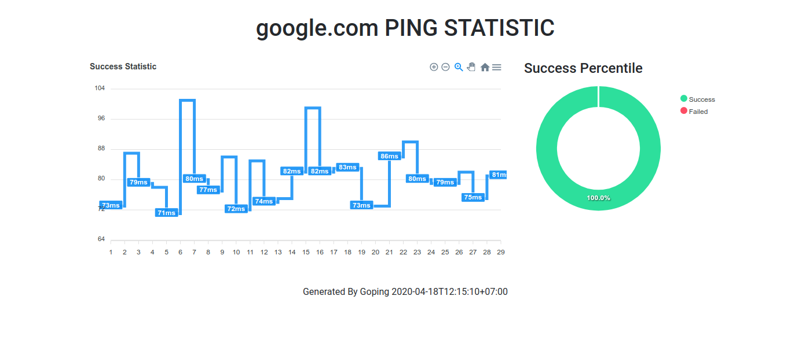

# Goping

ping implementation in Go based on golang.org/x/net/icmp as part [Cloudflare Internship Task](https://github.com/cloudflare-internship-2020/internship-application-systems)



## Building

1. Make sure Go already installed on your machine
2. run `go build`

## Usage

```
$ ./goping
usage: ./goping google.com
usage: ./goping -i 2 -t 3 127.0.0.1
usage: ./goping ::1
usage: ./goping -i 2 -t 3 -html google.com
  -html
    	Save HTML Output (ping statistic)
  -i int
    	request interval delay in second (default 1)
  -q	Quiet output. Nothing is displayed except summary when finished.
  -t int
    	request timeout in second (default 10)
  -ttl int
    	set IP Time To Live (default 64)
```

## Troubleshooting

* Q: socket: permission denied
* A: run ./goping as sudo or `sudo sysctl -w net.ipv4.ping_group_range="0 2147483647"`
